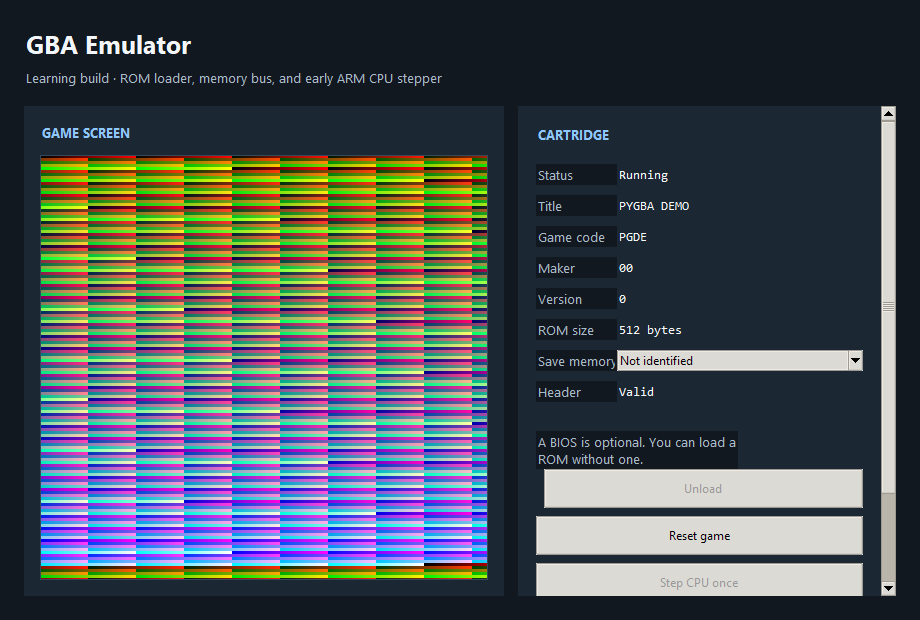

# GBA Emulator

An early Game Boy Advance emulator 

## Try it

Download the [Windows executable](dist/GbaEmulator.exe). Open a GBA ROM you may use and click **Run**. Windows 10 x64; Python isn’t needed.

**Controls:** arrows = D-pad; Z/X = A/B; A/S = L/R; Enter/Backspace = Start/Select.

## Features

ARM/Thumb CPU, graphics, timers, interrupts, sound, and SRAM/Flash/EEPROM saves. Unsupported instructions or hardware can stop games. You supply ROMs; no games or Nintendo BIOS are included. BIOS support is optional.

## Build

Run source with Python 3.10+: **python emulator_app.py**. Build Windows with PyInstaller, Pillow, **build_windows.ps1**.
